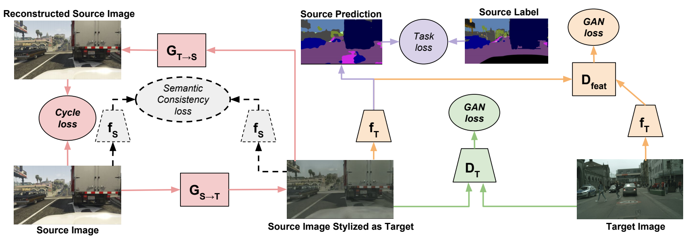

# Exploratory Directions and Concerns for the Future of Deep-Learning.

As I won't become a keynote speaker of an AI conference anytime soon, I decided to share some ideas about the future of Deep Learning. I will first propose some exploratory directions.

__I__ Symbolic Constraints

  By interpreting architectures like ResNet on ImageNet it has been understood, that training a multi-layered neural network results in a certain amount of symbolic abstraction: neurons based on their level become specialized from finding eyes and dog-faces to curvy vs straight textures and other mixed categories. What we see there, is the emergence of a symbolic language (though there are concerns to whether this is a language or just a vocabulary, something similar to a bag-of-words). Although we are fascinated by the fact that eyes and eye-like peacock feathers are translated to the same one hot vector, the problem is that sometimes the model doesn't frame this as a metaphor.

  Symbolic Deep Learning, has been proposed as a way to bridge modern AI (connectionist) with classical AI (symbolic). In classical AI the model is constructed based on symbolic rules (top-down/rational). In modern AI the model is constructed based on paradigms (down-top/empirical). But what if we embed a more complex symbolic element to these paradigms. The standard approach for doing so, was with loading a huge amount of annotations in the output of a model or a huge amount of features in the input (although the latter was more easier to avoid).

  Symbolic AI, is what generally comes to mind to a researcher that has to work with Deep Learning, because it is a trend but doesn't want to.
  It is a certain kind of nostalgia, of a certain era of research.
  So what he or she thinks is: "let's add more annotations. That we way we will agree on what reality."
  But you can't add more annotations, if you don't know how to structure a model and it's memory capacity.
  I like the idea that comes with the name of Tensorflow, because I think it captures well a feeling, I have with neural networks.
  It seems to me that neural networks resemble something like the CERN accelerator were instead of particles we have tensors that flow through the network with certain charges and which we want to hit a certain label. The convolutions act as adaptable magnets that try to learn a certain kind of physics by experience.
  So for this to work, we shouldn't only focus on dynamics of our data, but also on dynamics of our networks.

  Thus, alternatively, let's image a set of symbolic constraints: Instead of just agreeing on an output in a supervised manner, what you can also do is (1) constrain inner nodes of a model to fit certain outputs (e.g. like Mask-Rcnn or like intermediate loss in Convolutional Pose Machines Wei et al. 2016) and (2) make combinations of inner nodes to fit certain properties (e.g. a bit like dropout, but not randomized but more symbolic).
  For (1) someone can even combine older algorithms for eye separation or edge detection and fit a model to certain inner neurons.
  We can imagine this as shortcut for learning with components (see 4.)
  For (2) it is important first to add a sense of operational semantics to loss functions.
  For example, we could add a constraint on the amount of correlation between neurons.
  Or we could make inner parts of the network calculate a loss on other tasks every now and then.
  The problem and benefit of symbolic learning is that it restricts the model from developing its own deep-language (or abstract categorization) on cross-domain examples and tries to fit it in hard way to our symbolic abstractions. This proposal is for motivating its relaxation.

  As so I don't consider it as the way to go, but a first interesting exploratory experiment.

__II__ A science of architectures

  As we all have heard, noticed or know, Deep Learning has been considered the last years to be the same that alchemy was before the existence of chemistry. But will the equivalent of chemistry exist for deep-learning? In order to make deep learning meaningful, a lot of researchers have used interpretation techniques and well-annoted data. 
  But as the unsupervised part of neural networks becomes more and more important as a research direction, a science of architectures should be developed. We can imagine architecture for neural networks as the analogue circuitry in electronics. It is both a craft and a science. Craft as the tuning of a model, they way you stack layers and the small individual choices on parameters can create exceptional results, but the general approach behind it relies to certain properties of architectures, which can embody a categorization of certain data-species. From that concern, biology can also give as a clue for discovering architectures, either elementary like feed forward neural networks or complex as those for language processing. 

  An abstract language for neural networks may also be important: a set of mathematical constraints covered by the input and properties that give guarantees for convergence, independent of the instance of the data, but dependent on its abstract category. Neural Networks should thus be also studied, a. For example as we have the ideal resistor we should have the ideal RNN, which doesn't have a gradient explosion problem. In the way I vision it deep-learning in the future, will be in university courses a whole sector rather than a set of classes inside that of machine-learning. 

  The curse of interpretability. Math itself isn't aesthetically interpretable. Say you take a Wasserstein barycentric interpolation between two images. You say this is the natural interpolation between two images. But when you look at the transform you see something totally new. No preexisting aesthetic practice was similar to this and if aesthetics is governed by physicalized techniques, if it was this method would be redundant, if not more general or more performative.
  So math is consistent but not interpretable in the sense of "why something is done". But probabilities and statistics used in learning are also consistent in more relaxed terms: bounds and soft-methods.
  So interpretability, should be replaced with controllability and the latter is what a science of architectures could solve.

__III__ Adaptive architectures

  But what if we try to make the above idea, learnable. We have considered the architecture as something fixed, but both the data don't necessarily belong to a certain category, or maybe we don't need to say something scientific of where our data belongs, but rather exploit properties of data for constructing certain architectures that will generalise better on them, than others. Although, we maybe far from that as even things like hyper-parameter tuning is recently becoming artificially learnable, the idea of neuro-genesis or splitting like it's done in random-forest algorithms is not a new idea. I make the claim here, that if the technology of neural networks makes it possible of adapting an architecture to some data, while training the same model, this will cover the amazing properties of random forests (maybe not in performance). 

  So we should not only change the point of the position of the point as you minimize the loss, but also change the loss-landscape where x is minimized.
  An example of that is the min-max game as demonstrated, really nicely with GANs.
  In any case we should observe that finding out what architecture works for what problem is a problem of optimization itself.
  When I was introduced in neural networks I had this experience myself, of doing small perturbations of existing algorithms where the result didn't finally work (ceteris paribus).
  Finetuning your architecture becomes a very intuitive and it's not just a matter of trying things out.
  I can argue that AGI will be at the moment where intuition will not be a solution to human problems.

__IV__ Learning with Components

As inside the brain we can imagine that certain neurons work isolated, but others are combined with neurons from other parts of the brain, deep-learning systems will reach an AGI moment, only if they both become (1) spread and (2) diverse. By spread I mean that they will be learning from multiple domains (pictures, text, speech) at the same time and separately and by diverse that they will embody different processes of learning (such as organs do in functions of the body). We need brains not just models.
This also raises the problem of direction. Right now most deep-learning models work with the use of forward propagate (generate) and back-propagate (learn) methods.
But if we use the literary tool from Deleuze in learning, we shouldn't just be using trees but _rhizomes_ (something similar to graphs) with not a straight hierarchical structure, which are much more spread. The hierarchical idea of learning is not adapting to change and doesn't allow learning to happen.
What it basically does, is enforcing a model on reality and make reality fit this model.
But this is not what science is supposed to do, but rather the opposite: embrace a both creative and conscious experience of reality. 

>  

An Image from the paper of CyCADA summarizing a lot of what I've talked about: A combination of annotations, components, synthetic elements, architecture as in electronics and joint training of all the network.
"CyCADA: Cycle-Consistent Adversarial Domain Adaptation" Judy Hoffman et al.

I will try to close this article with two more sociological concerns.

__I__ GPUs
  The rise of AI came in bi-directional relationship with an existing business that found a new market: GPUs. Although this is cool, it has three main drawbacks:
  i. Price
    GPUs are expensive and doing anything novel may require a bunch of them. Both with the cloud based approach it leads in a centralised sense of resources. Where buying a machine is a commodity bought only once and used until outdated, nowadays the cloud-resources never get outdated, though being constantly a commodity. Sort of an analogy between using lime's and having your own bike. Of course having a lot of cars becomes a huge waste and restricts access to those who cannot afford buying one for themselves, but following the cloud approach creates a huge centralisation and in the long run becomes even more expensive (although in the case of GPUs execution times inside clouds are sometimes incomparably better). 

  ii. Power Consumption
    Using a GPU instead of a CPU, is like using a boiler instead of boiling water in a pot. But even worse as both the huge amount of Watts produced by GPUs as well as the replacement of CPUs with GPUs in deep-learning make them an even more expensive computational source. It is like replacing the pot with the boiler. It is not just a faster way to do things, but basically the only way things can be done. Also the fact that GPUs leave this sense of being fast makes researchers become really reckless in what they put for testing. With all that said it seems important to create a culture and a technology of recycling, for models. This means to allow already trained models to be used by new ones, in a way that will make the training of the later faster (as for example is done with transfer learning).

  iii. Shaping research directions
    A lot of researchers who currently are in top notch companies, develop experiments or models and _think_ in the context having huge clusters of gpu, on their. Such a practice doesn't make resources, but the science itself non secular, as it cannot be replicated by most researchers in the world and in a way cannot be understood. The power which lies behind such approaches makes the realisation that "Stacking more layers makes you network", seem like the go-to strategy for solving complex tasks with deep-learning.

__II__ Culture of the deep-learning community
  The progress of any scientific/technological community is always related to its social status as a community and the social backgrounds of its members. Deep Learning seems to have the ability to bring all the arts and sciences (phycisists, chemists, biologists, pharmacists, illustrators and more) together, but this unity is not back-propagated to all the members of the community. As so, even outside of private sector funding, we see that some problems are considered as much more important than others. As a result allocation of  capital (humans, resources, …) focuses more on certain kinds of task rather than others. For example deep-learning in music, doesn't have the prestige and the financial support that NLP has and unfortunately not the same voice.
  The fact is that science has always profited by solutions in different fields (there is never a single research application) and also itself can be thought of as a language that allows access to different fields. In juxtaposition to that we have the classic thing: tech guys talking about doing real science and saying that everybody else is using the fruit of their labour, while whining. This has to change. The individuals of the scientific community (of deep-learning) should become diversified  and not only the community, just being a bunch of people using a common tool.
  Of course not any of these problems are unique to this community, but its power could change it.

---

I do not claim the intellectual property, of any of the above. As in any member of a scientific community, individual knowledge, comes with a process of isolation and attention on crystallising the underlying ideas and debates of current scientific discourse. So excuse me if all of that is already out there. It will be at a certain point and this point will be redundant. I just hope for some, who have the ability of shaping the research directions of deep-learning that this becomes, for now at least, somewhat useful.
