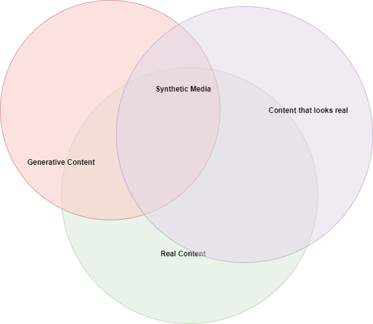

Synthetic media is an aesthetic technique or an aesthetic approach.
An essential part of it relates with what people in general call the _Fake_: fake news, deepfakes, etc.
In the past a lot of artists have used _ilussion_ as an aesthetic technique.
We could argue that when art tries to be representational - tries to create/represent a _reality_, illusion is its intrinsic in its practice.
In that context, we could roughly suggest that something becomes art because it is an illusion.
If someone could create real landscape from painting a wall, he wouldn't be called an artist.

Alike is this notion of the artist as a seducer or a deceiver (or a _haux_ as says [Keneth Goldsmith](https://www.youtube.com/watch?v=FAJRQJGc7DU)).
Even today there is a huge non-academic discourse, which contains certain elements and is offensive to artists and to their work.
They ask _"What is the job of an artists?"_. This has various manifestations from calling a work childish or even the well know phrase "I could do this" or "This is not science" (and thus it is anachronistic and occult - _pseudoscience_ some may call it).
In the same time, the same people wouldn't call learning to code _childish_, so there is a totally problematic element in this approach which is out of my reach to analyse - although I just want to point it out.
This also goes hand in hand with the fact that a good amount of people nowadays appreciate art, when they see a lot of work in it expressed as technique and technology.
This instrumentalization of art or its transformation to a spectacle (instead of a book it becomes a video), hides behind it a pejorative stance towards concepts and the essence of what the "work" of a _creative_ is.

Part of deception is also what makes an illusion a fascinating cognitive aesthetic experience.
It's like a trick of cards, where you know it's a trick but you either can't do it or reverse engineer it (which is also the case with a lot of tech).
The realist artist tries to trick you in a safe way: look there is the sea there.
It is also an affirmation of art as a way someone likes to see the world, of a way someone wants to live:
"Man is not restricted by its natural environment, it creates one as he/she pleases."
And in a way this is what technology does. But art is before technology and it does something different:
"It translates materiality as aesthetics."
It stands on the idea of "How you sense (thought included) things, makes them what they are."
And this my readers, comes inside a relation of power. 

So I could argue that synthetic media, come in the same plane as illusion but on a different direction.
In general AI engineers, consider reality as a probability distribution and thus modeling reality, means finding its __probability distribution__.
Such a probability distribution has a lot of random variables but selecting the most representative and flattening those representation, is a matter of encoding.  
"Learning is all about compression."  
After doing so you can just _sample_ from this probability distribution and you may end up with something real.
You could produce one billion faces from a single model, if you could just find a way to model faces.
"And compression-decompression is a matter of optimization."
As learning and optimization, really are kind of the same thing (where the second refers to a defined loss function), this is the context into which Deep-Learning models are so successful. The can scale, they can capture non-linearities of a higher order and can model real world data (which is not that random).

There is a consensus among researchers that data such as human images _live_ on a surface in high dimensional world.  
This means you need to encode this surface, in a lower dimension.
This is where generative models such as GANs and Variational-Autoencoders, have paved the road for imagining a future where synthetic media will be possible.

So synthetic media come at the intersection of what looks real and what can be generated and synthesized from reality.  

There is a bigger part of what exists that looks real and this is where synthesized realities can come and play a role.
If an image is an object that can be thought outside of its standard context - the backstage of its shooting - then synthetic media can find a place to breathe.
Their practice can be dialectic, as "fake" images will be part of the real, as long as someone can't detect or doesn't bother to detect their origin.
The existence of various forensic methods nowadays, is an indication that people try to frame the _fake_ as an illusion.

Synthetic media, make art more conceptual as the model becomes part of computational in-silica infrastructure and at the same time,
the artwork becomes the idea, which can be replicated, transformed, reimplemented millions of times and where a certain instance of this work, doesn't have much importance on itself, but can find one on in a certain locality. 

One could then argue: "But the computer engineer that creates and train this models becomes the artist."
Until people are much more advanced cyborgs and until artist are both computer engineers this is wrong.
It would be like saying that people that make canvases, that teach history of art and create electricity are artists.
One of the most difficult challenges in most people's practices, is that parts of it could be framed as art, but they can't do it.
If this wasn't true Rickie Gervais office would be any office (or the office Rickie used to work in) and Rickie Gervais wouldn't have been considered an artist.
Framing something as art is combination of skill and power (influence, fame and interest).

So for what there is to come, we are excited to be part of it.
You can see some of our projects the twitter-bots and the MangAI, listed [here](../projects/index.md).
